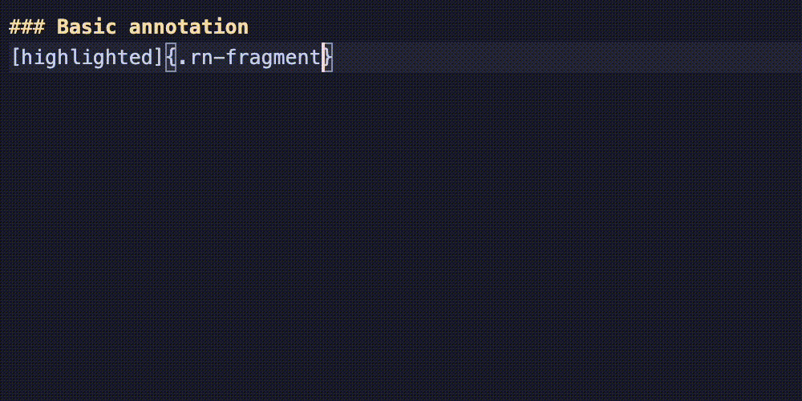
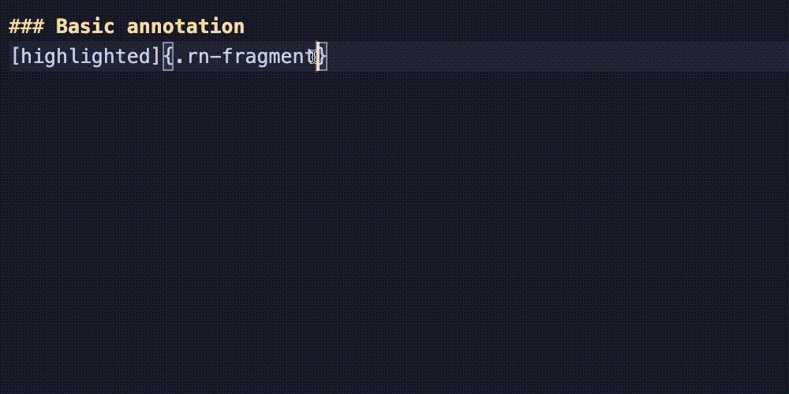
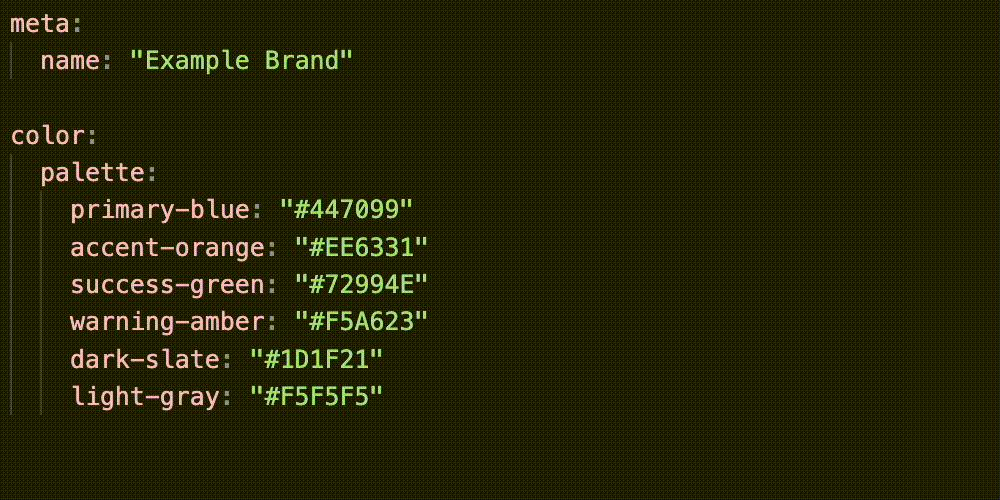
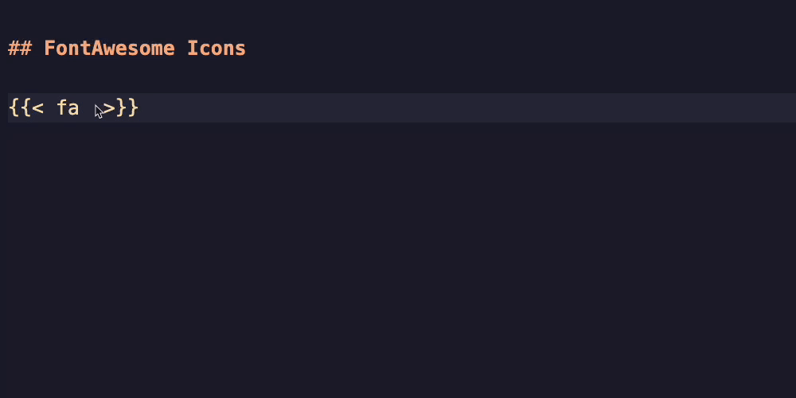
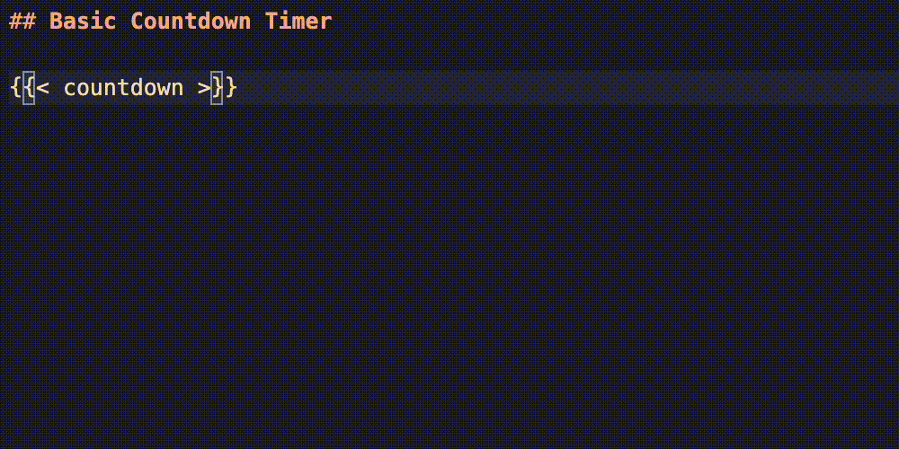

# Quarto Extension Helpers

VS Code extension providing autocomplete and editor support for popular Quarto extensions.

## Features

### Supported Extensions

- [roughnotation](https://github.com/EmilHvitfeldt/quarto-roughnotation)
- [fontawesome](https://github.com/quarto-ext/fontawesome)
- [countdown](https://github.com/gadenbuie/countdown)

## Installation

<!-- TODO: Add marketplace link once published -->

1. Open VS Code
2. Go to Extensions (Ctrl+Shift+X / Cmd+Shift+X)
3. Search for "Quarto Extension Helpers"
4. Click Install

## Extension Support

### Roughnotation

Provides intelligent autocomplete for [quarto-roughnotation](https://github.com/EmilHvitfeldt/quarto-roughnotation) spans.

#### Attribute Autocomplete

Type inside `{.rn-fragment }` or `{.rn }` spans to get suggestions for all roughnotation attributes:



**Supported attributes:**
- `rn-type` - Annotation type (highlight, underline, box, circle, strike-through, crossed-off, bracket)
- `rn-color` - CSS color for the annotation
- `rn-animate` - Enable/disable animation
- `rn-multiline` - Multi-line annotation support
- `rn-brackets` - Bracket positions (left, right, top, bottom)
- `rn-animationDuration` - Animation duration in ms
- `rn-strokeWidth` - Stroke width in pixels
- `rn-padding` - Padding around annotation
- `rn-iterations` - Number of drawing passes
- `fragment-index` - RevealJS fragment ordering

#### Value Autocomplete

After typing an attribute name and `=`, get suggestions for valid values:


#### Color Picker

Click the color swatch next to any `rn-color` value to open VS Code's native color picker:



#### Brand Color Integration

If your project has a `_brand.yml` file with a color palette, those colors appear first in `rn-color` suggestions:



```yaml
# _brand.yml
color:
  palette:
    primary-blue: "#447099"
    accent-orange: "#EE6331"
```

When you select a brand color, the hex value is inserted (since roughnotation doesn't understand brand color names).

### FontAwesome

Provides intelligent autocomplete for [quarto-fontawesome](https://github.com/quarto-ext/fontawesome) shortcodes.

#### Icon Autocomplete

Type inside `` shortcodes to get suggestions for all FontAwesome 6 free icons:



**Supported icon types:**
- Regular icons: ``
- Brand icons: ``

#### Attribute Autocomplete

After typing an icon name, get suggestions for attributes:

- `size` - Icon size with values for HTML (`2xs`, `xs`, `sm`, `lg`, `xl`, `2xl`, `1x`-`10x`) and LaTeX/PDF (`tiny`, `small`, `large`, `Huge`, etc.)
- `title` - Accessibility title text

**Examples:**
```markdown



```

#### Filtering

Start typing to filter icons by name:

- Type `th` to see icons like `thumbs-up`, `theater-masks`, `thermometer`
- Type `brands g` to see brand icons like `brands github`, `brands google`

### Countdown

Provides intelligent autocomplete for [countdown](https://github.com/gadenbuie/countdown) timer shortcodes.

#### Attribute Autocomplete

Type inside `` shortcodes to get suggestions for all countdown attributes:



**Timer attributes:**
- `minutes` - Duration in minutes
- `seconds` - Duration in seconds
- `play_sound` - Play fanfare on completion
- `start_immediately` - Auto-start timer when slide appears
- `warn_when` - Seconds remaining to trigger warning state
- `update_every` - Update frequency in seconds
- `blink_colon` - Blinking colon effect

**Position attributes:**
- `top`, `bottom`, `left`, `right` - Position from edges (e.g., "10px", "1em")

**Style attributes:**
- `font_size` - Timer text size (default: "3rem")
- `margin` - Spacing around timer
- `padding` - Internal spacing
- `border_width` - Border thickness
- `border_radius` - Corner rounding
- `line_height` - Text line spacing
- `box_shadow` - Shadow effect
- `id` - Unique identifier for custom CSS

**Color attributes:**
- `color_border`, `color_text`, `color_background` - Base colors
- `color_running_*` - Running state colors (background, border, text)
- `color_finished_*` - Completion state colors
- `color_warning_*` - Warning state colors

#### Value Autocomplete

After typing an attribute name and `=`, get suggestions for valid values:

- Boolean attributes (`play_sound`, `start_immediately`, `blink_colon`) show `true`/`false`
- Color attributes show brand colors (if `_brand.yml` exists) and common CSS colors

#### Brand Color Integration

If your project has a `_brand.yml` file, brand colors appear first in color attribute suggestions:

```yaml
# _brand.yml
color:
  palette:
    primary-blue: "#447099"
    accent-orange: "#EE6331"
```

When you select a brand color, the hex value is inserted (since countdown doesn't understand brand color names).

**Examples:**
```markdown




```

## Requirements

- VS Code 1.85.0 or higher

## Development

### Setup

```bash
git clone https://github.com/EmilHvitfeldt/quarto-extension-helpers.git
cd quarto-extension-helpers
npm install
```

### Commands

| Command | Description |
|---------|-------------|
| `npm run compile` | Compile TypeScript to JavaScript |
| `npm run watch` | Compile and watch for changes |
| `npm run package` | Create `.vsix` package for local testing |
| `npm run publish` | Publish to VS Code Marketplace |
| `npm run publish:ovsx` | Publish to Open VSX Marketplace |

### Testing Locally

1. Run `npm run package` to create a `.vsix` file
2. In VS Code, open the Extensions view (Ctrl+Shift+X / Cmd+Shift+X)
3. Click the `...` menu → "Install from VSIX..."
4. Select the generated `.vsix` file

Or press F5 to launch the Extension Development Host with the example files.

### Publishing

#### VS Code Marketplace

1. Install vsce if needed: `npm install -g @vscode/vsce`
2. Login to your publisher account: `vsce login EmilHvitfeldt`
3. Run `npm run publish`

See the [VS Code Publishing Guide](https://code.visualstudio.com/api/working-with-extensions/publishing-extension) for more details.

#### Open VSX Marketplace

1. Install ovsx if needed: `npm install -g ovsx`
2. Get an access token from [Open VSX](https://open-vsx.org/)
3. Run `npm run package` to create the `.vsix` file
4. Publish: `ovsx publish quarto-extension-helpers-0.1.0.vsix -p <token>`

See the [Open VSX Wiki](https://github.com/eclipse/openvsx/wiki/Publishing-Extensions) for more details.

## Contributing

Contributions are welcome! If you'd like to add support for another Quarto extension:

1. Create a new file in `src/` named after the extension (e.g., `src/lightbox.ts`)
2. Implement a `CompletionItemProvider` for the extension's attributes
3. Register the provider in `src/extension.ts`
4. Add documentation to this README

See `src/roughnotation.ts` for a reference implementation.

## License

MIT - see [LICENSE](LICENSE) for details.

## Acknowledgments

- [Quarto](https://quarto.org/) - Open-source scientific and technical publishing
- [Rough Notation](https://roughnotation.com/) - Library for creating sketch-style annotations
- [FontAwesome](https://fontawesome.com/) - Icon library
- [Countdown](https://pkg.garrickadenbuie.com/countdown/) - Countdown timers for presentations
